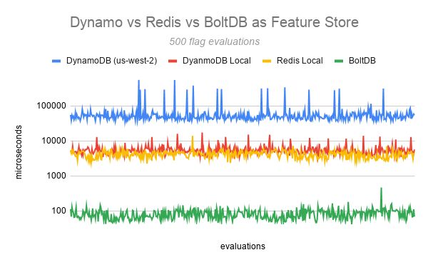

# launchdarkly-embedded

## Purpose
The purpose of this project was to play around with embedded databases in Go. 
I've heard a bit about them and wanted to learn more. 
In this project specifically, I used [BoltDB](https://github.com/boltdb/bolt).

## Reasons to Use an Embedded Database
* Typically very fast (more on this later..)
* Everything is local
* Simple / Maintenance free
* Easy to export / move around
* Single file (typically)
* Survives LaunchDarkly going down
* Offline mode

## Reasons Not to Use an Embedded Database
* No ad-hoc querying
* No Security / Replication / Access-control built-in
* High coupling between database and application (it goes wherever your app goes)

## What does this have to with LaunchDarkly?
LaunchDarkly has a Go SDK. In that SDK, you can define a custom feature store.
As of 04/20, we support Redis, Dynamo, and Consul.
You can learn more [here](https://docs.launchdarkly.com/sdk/concepts/feature-store).

Why use a persistent feature store? Well the LaunchDarkly docs explains it.
>The main reason to do this is to accelerate flag updates when your application has to restart, 
>and after restarting, it takes longer to establish a connection to LaunchDarkly than you want. 
>If you have a persistent feature store that has already been populated, the SDK can still evaluate
>flags using the last known flag state from the store until newer data is available from LaunchDarkly.

You can even use Relay mode, which allows you to run your app without connecting to LaunchDarkly at all.
```go
config.UseLdd = true
```

## Benchmarking:
(Read only)
Let's evaluate the same flag 500 times.


* Using DynamoDB (us-west-2 / Oregon): 58 milliseconds
* Using DynamoDB (local): 3.65 milliseconds
* Using Redis (local): 1.7 milliseconds
* Using BoltDB: 35 microseconds

So.. roughly ~1000x faster compared to DynamoDB

## Things left to do:
* Write unit tests
* Documentation
* Test against many flags for both r/w instead of reading from a single flag

## Summary
* Speed! Reads are way faster than the traditional data stores.
* Embedded databases have a niche use case and poses tradeoffs. All things should be considered if deciding when to use it.
* Ability to survive restarts / offline mode.
